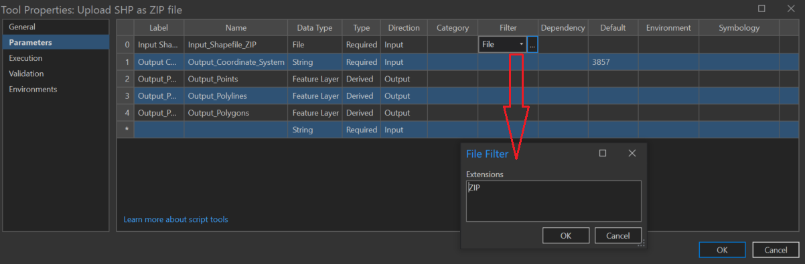
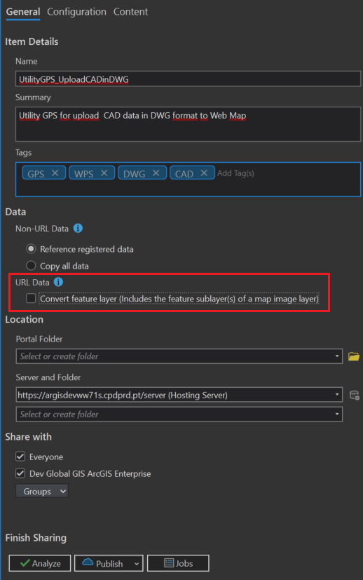
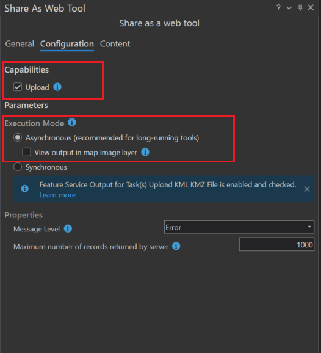
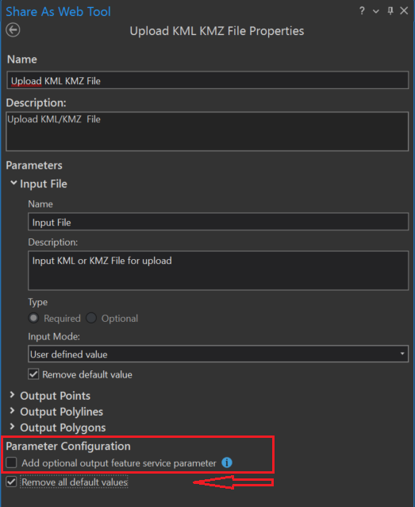

# esri.arcpy.conversionTools-file2GDB
Herramientas de conversión de formatos GIS de ESRI con ArcPy
=======
# Services for Uploading Files

## Overview  
- In ArcGIS Pro, tools convert source files to GDB and load them onto the map.  
- As ArcGIS Server services, they must load layers onto the map without creating Hosted Feature Layer Services.  

## Available Services  
1. **Shapefile** (compressed in ZIP)
2. **CAD File** (DWG format)  
3. **KML or KMZ**  

First tool is availables in a python file called *upload_shapefile_Actual.py* which must be configured in a toolbox.
Second and thirth are available as *.pyt* file (python toolbox with name *upload_cad_andkmz.pyt*), consequently only is necesary to add this toolboxes to the ArcGIS Pro project.

## Configuring parameter options in CAD files python script
Configure the toolbox to properly use the python script to upload CAD files.
Here it is possible to see the options to enter for each parameter to be configured. You can filter the type of files allowed by entering their extensions.

## Publishing  
When publishing from ArcGIS Pro 3.3, the following options should be considered to ensure that hosted layers are not created.

### General Tab

### Configuration Tab
Upload must be activated in order to allow select a local file.

### Content Tab
In the content tab and after clicking on the options pencil, the _Add optional output feature service parameter_ box is deactivated and, optionally, you can activate or deactivate the "Remove all default values" box, not do so or do so only in the parameters that are considered appropriate.

>>>>>>> ed862e4 (subida inical del repositorio)
